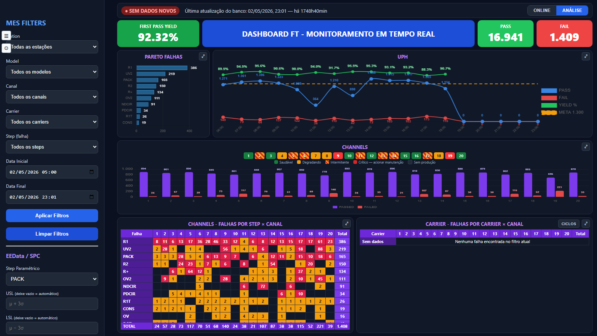
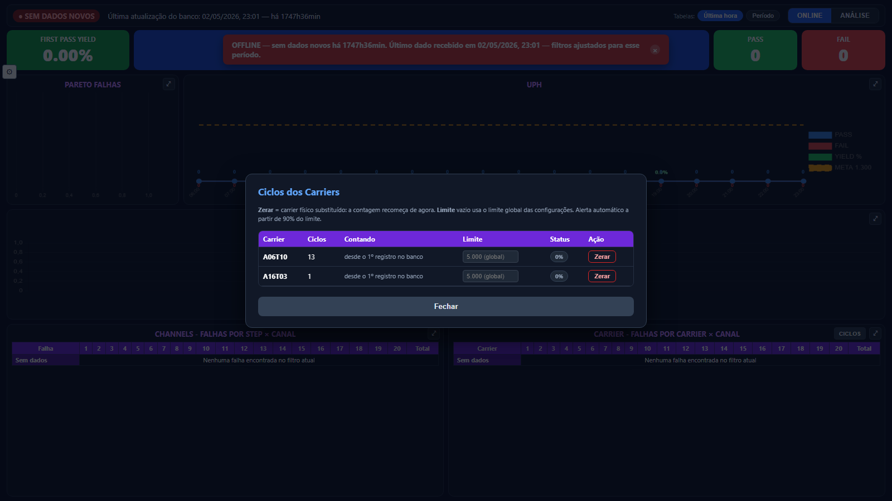
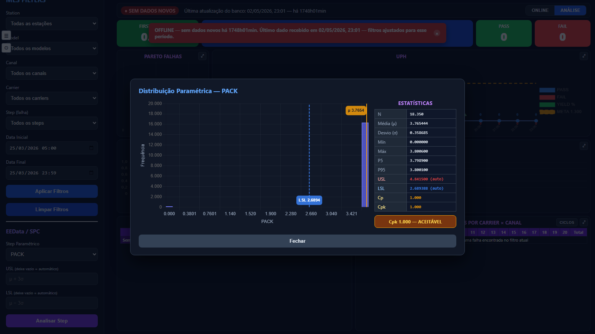

# MES Dashboard — Painel de Produção em Tempo Real

> Dashboard de First Pass Yield, UPH e rastreabilidade de falhas para linha de produção industrial — Salcomp Manaus.


---

## Screenshots

| Painel principal (ONLINE) |
|---|
|  |

| Gestão de ciclos dos carriers | EEData / SPC — distribuição paramétrica (Cp/Cpk) |
|---|---|
|  |  |

---

## Visão Geral

O **MES Dashboard** é um painel web para chão de fábrica que lê diretamente da tabela `mes_test_results` (populada por um sistema externo — o [MES Client](https://github.com/robertoeng-dev/mes-client)) e apresenta, em tempo real, a saúde da linha de teste: First Pass Yield, PASS/FAIL, tendência de UPH por hora, pareto de falhas, e matrizes de falha por canal e por carrier.

```
Testador (CSV) → MES Client → PostgreSQL (mes_test_results) → MES Dashboard (este projeto)
```

A aplicação é **estritamente somente leitura** contra `mes_test_results` — nenhuma migração, nenhum INSERT/UPDATE naquela tabela. A única tabela que este app escreve é `dashboard_carriers`, criada por ele mesmo, para gerenciar o ciclo de vida dos carriers (contador de passagens + limite configurável).

Projetado para dois públicos:
- **Operador de linha** (modo **ONLINE**): resposta em segundos — o testador está online? Algum canal degradando ou intermitente? Precisa acionar manutenção?
- **Engenharia** (modo **ANÁLISE**): filtros completos (estação, modelo, canal, carrier, step, período) para investigação histórica, incluindo análise de capabilidade de processo (Cp/Cpk).

---

## Funcionalidades

| Módulo | Descrição |
|--------|-----------|
| **First Pass Yield** | Card de yield, PASS e FAIL em tempo real, com atualização automática configurável |
| **UPH + Meta + Yield** | Gráfico de produção por hora com linha de meta (tracejada) e linha de yield % (eixo secundário) |
| **Pareto de Falhas** | Top N falhas do período, quantidade configurável |
| **Saúde por canal** | Régua de 20 canais colorida por yield: saudável / degradando / **intermitente** (detecção de alternância crítico↔normal) / crítico |
| **Matrizes Falha×Canal e Carrier×Canal** | Tabelas com célula quente (>N falhas) e linha TOTAL por canal, coluna auto-ajustável ao maior nome |
| **Gestão de ciclos dos carriers** | Contador de passagens pelo testador por carrier, limite individual ou global, aviso automático (90% e 100%), "Zerar" ao substituir fisicamente o carrier |
| **EEData / SPC** | Distribuição paramétrica de qualquer step numérico (histograma + USL/LSL + Cp/Cpk automático ou manual) |
| **Modos ONLINE / ANÁLISE** | ONLINE: período automático 05:00→agora, sem filtros manuais. ANÁLISE: todos os filtros liberados, nada se reajusta sozinho |
| **Detecção online/offline** | Banner + faixa de status comparando o último registro do banco contra um limiar configurável |
| **Modo TV** | Tela cheia, sem filtros — para o monitor do chão de fábrica |
| **Configurações** | Meta de produção, limites de saúde do canal, limite de ciclos, intervalo de atualização, tudo em um modal, persistido por navegador |
| **Painéis ampliáveis** | Qualquer gráfico/tabela expande em tela cheia (estilo Streamlit) |

---

## Arquitetura

```
mes_server-06-07-2026/
├── mes_server/
│   ├── settings.py          # Carrega .env (produção) ou .env.local (dev) via DJANGO_ENV
│   ├── urls.py
│   └── wsgi.py / asgi.py
├── dashboard/
│   ├── services.py          # TODA a lógica: SQL cru via connection.cursor(), sem ORM
│   ├── views.py              # Views finas: filtros → services.<fn>() → JsonResponse
│   ├── urls.py                # /api/summary/, /api/channels/, /api/spc/distribution/, ...
│   ├── models.py             # Vazio de propósito — mes_test_results não é dono deste app
│   ├── templates/dashboard/index.html
│   └── static/dashboard/
│       ├── css/style.css
│       └── js/dashboard.js   # SPA sem framework: fetch + Chart.js, sem bundler
├── requirements.txt
├── manage.py
├── start_local.bat            # DJANGO_ENV=local — banco de desenvolvimento
├── start_production.bat       # DJANGO_ENV=production — banco real da fábrica
└── CLAUDE.md                  # Notas de arquitetura detalhadas para desenvolvimento assistido por IA
```

**Camada de normalização de schema.** O testador grava dados como JSON (`row_data`) com nomes de chave que variam por estação/fonte (`Station` vs `station_id` vs `machine_no`, `TestResult` vs `result`, etc.). `services.get_exprs()` centraliza essa normalização em expressões SQL `COALESCE`, reaproveitadas por toda consulta — nenhuma função hardcoda uma chave JSON.

**Defesas contra corrupção de dados na origem.** Linhas corrompidas (texto de cabeçalho gravado como valor, lixo binário de arquivo truncado) são tratadas na camada de leitura: literais conhecidos de cabeçalho são ignorados via `NULLIF` em cascata, e os dropdowns de filtro passam por um gate de sanidade (regex + limite de tamanho) antes de chegar à interface — sem alterar os totais agregados.

---

## Stack Tecnológico

| Tecnologia | Uso |
|------------|-----|
| Python 3.13 | Linguagem principal |
| Django 6.0 | Views + roteamento (sem ORM para os dados de teste) |
| PostgreSQL 13+ | Banco de dados (`FILTER`, `->>`, `date_trunc`, `generate_series` — específico do Postgres) |
| psycopg2 | Driver PostgreSQL |
| pandas / numpy / scipy | Estatística do módulo SPC (histograma, Cp/Cpk) |
| Chart.js 4 + chartjs-plugin-datalabels + chartjs-plugin-annotation | Gráficos (CDN, sem bundler) |
| HTML/CSS/JS puro | Frontend SPA, sem framework |

---

## Instalação

```bash
# 1. Clonar o repositório
git clone https://github.com/robertoeng-dev/mes-server.git
cd mes-server

# 2. Criar ambiente virtual
python -m venv venv
venv\Scripts\activate          # Windows

# 3. Instalar dependências
venv\Scripts\pip install -r requirements.txt

# 4. Configurar (nunca editar .env de produção — usar .env.local para dev)
copy .env.local.example .env.local
# Editar .env.local com DB_HOST/DB_USER/DB_PASSWORD/DB_NAME do seu Postgres

# 5. Executar contra o banco local/dev
start_local.bat
# ou manualmente:
set DJANGO_ENV=local
venv\Scripts\python.exe manage.py runserver
```

Acesse `http://127.0.0.1:8000/`.

### Executar contra a fábrica (produção)

```bash
start_production.bat
```

Requer `.env` preenchido com as credenciais reais do Postgres da fábrica (arquivo gitignored, nunca commitado). Binda em `0.0.0.0:8000` para ser acessível de outras máquinas na rede corporativa (ex.: o monitor do chão de fábrica).

---

## Configuração

| `DJANGO_ENV` | Arquivo | Banco |
|---|---|---|
| `production` (padrão) | `.env` | Postgres real da fábrica — **dados de produção** |
| `local` | `.env.local` | Postgres de desenvolvimento — seguro para testar |

Todas as preferências visuais (meta de produção, limites de saúde do canal, limite de ciclos, intervalo de atualização, modo TV) ficam no navegador (`localStorage`), ajustáveis pelo modal de Configurações (⚙) — sem precisar editar código.

---

## Banco de Dados

**`mes_test_results`** — populada pelo [MES Client](https://github.com/robertoeng-dev/mes-client), somente leitura aqui. Schema flexível via coluna JSON (`row_data`/`raw_data`), normalizado em tempo de consulta.

**`dashboard_carriers`** — única tabela que este app escreve, criada automaticamente (`CREATE TABLE IF NOT EXISTS`, sem migração Django). Guarda `cycle_limit` (limite individual do carrier) e `baseline_at` (timestamp de reset ao substituir o carrier fisicamente).

---

## Roadmap

- [ ] Alertas automáticos por e-mail/Teams quando yield cair abaixo do limite
- [ ] Relatórios PDF automáticos por turno
- [ ] Exportação para Excel
- [ ] Mapeamento de schema alternativo (testes BMU) como fonte reconhecida no dashboard

---

## Projetos Relacionados

- **[MES Client](https://github.com/robertoeng-dev/mes-client)** — aplicação desktop que coleta os CSVs dos testadores e alimenta o banco que este dashboard lê.

---

## Licença

MIT
